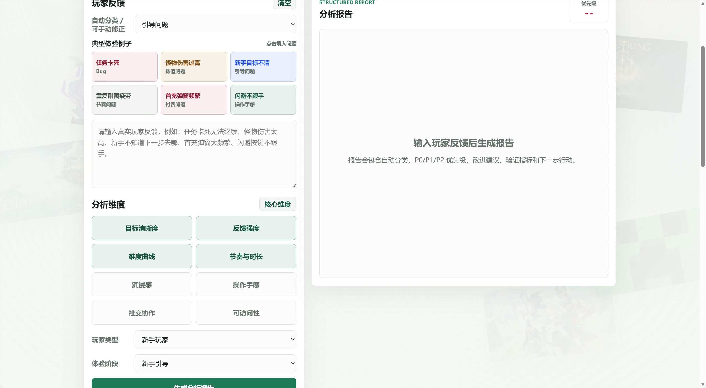

# 游戏体验分析助手

一个纯前端网页原型，用于把玩家反馈自动分类为体验问题，生成结构化分析报告，并支持保存与导出 Markdown。

## 功能

- 精美入口“大门”页，点击「开始体验分析」进入功能工作台。
- 打开网页后即可使用，无需后端服务。
- 输入玩家反馈，系统会自动分类。
- 自动分类范围：Bug、数值问题、引导问题、节奏问题、付费问题、操作手感，也可以手动修正分类。
- 从典型体验例子中快速填入问题。
- 选择分析维度：目标清晰度、反馈强度、难度曲线、节奏与时长、沉浸感、操作手感、社交协作、可访问性。
- 生成结构化分析报告：玩家反馈、自动分类结果、P0/P1/P2 优先级、问题判断、可能原因、改进建议、验证指标和下一步行动。
- 根据负面反馈生成参考解决方案：包含适用反馈、处理动作和验证方式。
- 保存报告到浏览器本地存储，并支持载入、删除、清空。
- 导出 Markdown 报告。
- 附带截图与 1 分钟演示视频位置。

## 本地运行

直接打开 `index.html` 即可。

也可以在项目目录启动本地静态服务：

```powershell
python -m http.server 5173
```

然后访问：

```text
http://localhost:5173
```

## 项目结构

```text
.
├── index.html
├── styles.css
├── app.js
├── package.json
├── LICENSE
├── .gitignore
├── README.md
└── assets/
    ├── screenshot.png
    └── demo.mp4
```

## 使用流程

1. 输入玩家反馈，或点击一个典型体验例子。
2. 系统自动分类；如需调整，可以手动修正分类。
3. 选择要分析的维度。
4. 选择玩家类型和体验阶段。
5. 点击「生成分析报告」。
6. 点击「保存报告」加入已保存报告列表，或点击「导出 Markdown」下载文件。

## 开发脚本

```powershell
npm run check
npm run start
```

## 作品集快速展示

如果只是想把网页发给岗位负责人查看，推荐使用 Netlify Drop：

```powershell
.\make-showcase-package.ps1
```

运行后打开 `https://app.netlify.com/drop`，把 `portfolio-package\netlify-drop\game-experience-analysis-assistant` 文件夹拖进去即可生成在线链接。更详细的交付说明见 [PORTFOLIO_HANDOFF.md](./PORTFOLIO_HANDOFF.md)。

## 截图



## 演示视频

演示视频文件：`assets/demo.mp4`

## 背景素材来源

页面背景中的游戏素材图为远程引用，用于原型展示和视觉氛围设计：

- ELDEN RING：Steam 商店页封面图
- The Legend of Zelda: Tears of the Kingdom：Nintendo 商店页图片
- Genshin Impact：HoYoverse 官方页面分享图
- VALORANT：Riot Games 官方媒体页图片
- Minecraft：Minecraft 官方页面图片
